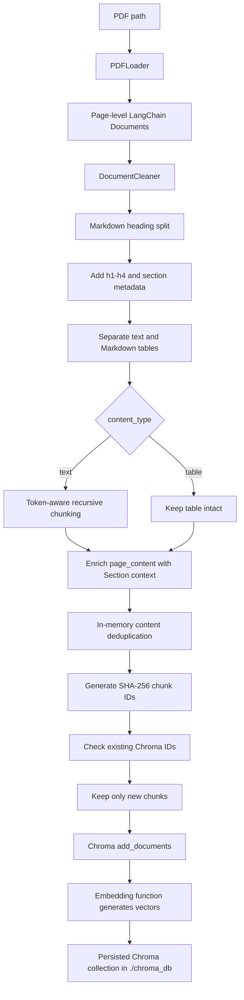
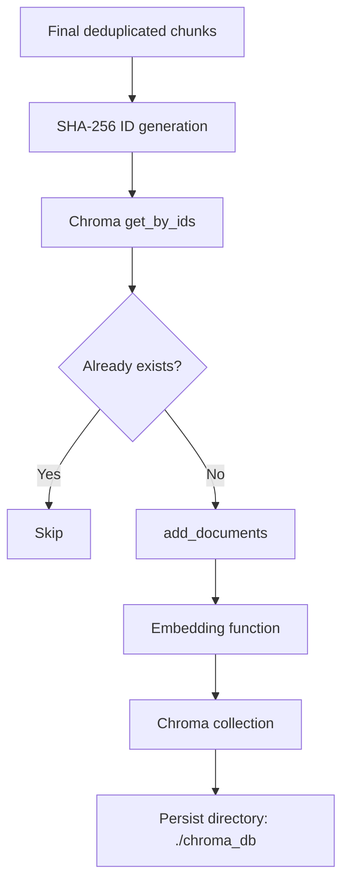
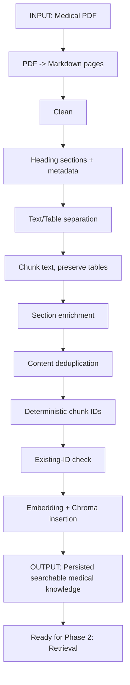

# Phase 1: Indexing - Medical RAG Study Chapter

> Repository scope: this chapter is grounded in the uploaded `document_processing` package. It documents what the supplied source code actually does, separates that behavior from conceptual explanation, and explicitly marks missing configuration or functionality instead of guessing.

## Repository truth at a glance

Before studying the pipeline, keep these facts in mind:

- The uploaded ZIP contains only the `document_processing` package, not the full application.
- The source imports `src.config.settings`, but that settings module is not included in the ZIP.
- Therefore, the exact values of `CHUNK_SIZE`, `CHUNK_OVERLAP`, `EMBEDDING_MODEL_NAME`, and `COLLECTION_NAME` cannot be recovered from the supplied source.
- The active end-to-end processor uses `PDFLoader`. `TextLoader` and `URLLoader` exist, but they are not wired into `DocumentProcessor.document_processing_pipeline()`.
- The project creates a Chroma vector index. No BM25 or other lexical index is implemented in the supplied source.
- The pipeline performs two kinds of duplicate prevention: in-memory content deduplication and persistent ID-based duplicate prevention before Chroma insertion.
- The pipeline preserves Markdown tables as whole blocks rather than splitting them with the recursive text splitter.
- A compiled `__pycache__/pipeline.cpython-314.pyc` file exists, but there is no current `pipeline.py` source file. This chapter treats the current `.py` source files as authoritative.
- `processor.py` contains a `__main__` call that does not match the current `document_processing_pipeline()` signature, so the direct script entry point is not runnable as written.

---

# 1. Medical RAG Architecture Overview

A complete Retrieval-Augmented Generation system can be understood as three large phases:

```text
Medical Documents
        |
        v
Phase 1: Indexing
        |
        v
Searchable Knowledge Base
        |
        v
Phase 2: Retrieval
        |
        v
Relevant Medical Context
        |
        v
Phase 3: Generation
        |
        v
Grounded Response
```


> This document focuses only on Phase 1: Indexing.

Indexing exists to transform raw human-readable source material into smaller, structured, searchable units that a later retrieval phase can search efficiently.

The key idea is:

```text
Raw Medical Data
       |
       v
Processed Medical Knowledge
       |
       v
Searchable Representation
```

In this repository, the searchable representation is a persisted Chroma collection containing final LangChain `Document` chunks, their metadata, deterministic IDs, and embeddings generated by the configured embedding function.

---

# 2. What Is Indexing?

## 2.1 The first-principles idea

In RAG, indexing is the offline or preparation phase that converts source documents into records that can later be searched.

A large medical PDF is useful to a human reader, but it is not yet a convenient retrieval unit. The indexing pipeline therefore performs a sequence of transformations:

1. Read the source.
2. Preserve useful provenance and metadata.
3. Clean obvious text noise.
4. recover logical sections from Markdown headings.
5. Separate normal prose from Markdown tables.
6. Split long text into smaller chunks.
7. Add section context directly to the chunk text.
8. Remove exact-content duplicates after normalization.
9. Create stable chunk IDs.
10. Store only new chunks in Chroma.
11. Let the configured embedding model create the vectors used by Chroma.

## 2.2 Why not send all medical documents directly to the LLM?

A full knowledge base can be much larger than an LLM context window. Even when a document technically fits, sending every source for every question is inefficient and makes it harder to focus on the most relevant evidence.

Indexing solves the preparation problem. It makes the corpus searchable before a user asks a question.

## 2.3 Why preprocess documents?

Raw extracted text can contain:

- repeated horizontal whitespace,
- non-breaking spaces,
- zero-width characters,
- excessive blank lines,
- headings mixed with paragraphs,
- Markdown tables mixed with normal prose,
- duplicate chunks.

The repository handles several of these problems explicitly before storage.

## 2.4 Why split documents?

Retrieval normally works better when the searchable unit contains a focused piece of information instead of an entire long file.

The supplied implementation first splits by Markdown headings and then applies a token-aware recursive chunker to normal text. Tables are treated differently: they are kept intact.

## 2.5 Why generate embeddings?

An embedding converts text into a numeric vector representing semantic information.

```text
Medical text
    |
    v
Embedding model
    |
    v
[0.021, -0.183, 0.447, ...]
```

Later, semantically similar query and chunk vectors can be compared during retrieval.

The repository uses `HuggingFaceEmbeddings` with a model name obtained from external settings.

## 2.6 Why store metadata?

Metadata keeps context about where a chunk came from and what it represents. In this project, metadata can include:

- source path,
- source type,
- file name and extension,
- file timestamps,
- PDF metadata such as title and author,
- page number,
- Markdown heading levels,
- hierarchical section path,
- content type (`text` or `table`).

This is especially useful for a medical RAG system because later retrieval can preserve provenance and potentially filter by source or structural information.

## 2.7 Why might a system have vector and BM25 indexes?

Conceptually, vector search is useful for semantic similarity, while BM25 is useful for lexical matching.

```text
Vector idea:
"heart attack" <-> "myocardial infarction"
```

```text
Lexical idea:
"myocardial infarction" -> exact words matter
```

However, **the supplied indexing package does not implement BM25 or another lexical index**. Only Chroma vector storage is present. A future hybrid retrieval architecture could add a lexical index, but that would be an extension, not current behavior.

## 2.8 What exists at the end of indexing?

For newly discovered chunks, Chroma receives:

```text
Chunk
|-- deterministic ID
|-- page_content
|-- metadata
`-- embedding generated through the configured embedding function
```

Chroma persists its data under:

```text
./chroma_db
```

The collection name comes from `settings.COLLECTION_NAME`.

---

# 3. Phase 1 Goal

## Conceptual goal

```text
Input:
Raw medical documents

Output:
Clean, structured, chunked, searchable medical knowledge
ready for Phase 2: Retrieval
```

## Actual repository goal

The current processor is specifically wired to a PDF path.

```text
Input:
PDF path + configured Chroma/embedding setup

Output:
New final chunks persisted in a Chroma collection
```

The processor itself returns only a status string such as:

```python
'Document Added.'
```

It does not return the final chunk objects, inserted IDs, counts, or a manifest to the caller.

---

# 4. Project Folder Structure

The uploaded source package is:

```text
document_processing/
|-- __init__.py
|-- cleaner.py
|-- embeddings.py
|-- loader.py
|-- processor.py
|-- splitter.py
|-- vector_store.py
|-- loaders/
|   |-- __init__.py
|   |-- base.py
|   |-- pdf_loader.py
|   |-- text_loader.py
|   `-- url_loader.py
`-- __pycache__/
    |-- ... compiled cache files ...
    `-- pipeline.cpython-314.pyc
```

The `__pycache__` directory is generated bytecode and is not part of the active source design. The interesting detail is that it contains `pipeline.cpython-314.pyc` even though there is no matching current `pipeline.py`. That indicates an older source file existed at some point, but the current `.py` files are what should be maintained and documented.

## 4.1 File responsibilities

| File | Responsibility |
|---|---|
| `document_processing/__init__.py` | Exposes `DocumentProcessor` from the package. |
| `loader.py` | Thin loader facade: accepts a `BaseLoader` and calls `load()`. |
| `loaders/base.py` | Abstract interface for all document loaders. |
| `loaders/pdf_loader.py` | Loads a PDF page by page as Markdown and attaches filesystem, PDF, and page metadata. |
| `loaders/text_loader.py` | Loads one UTF-8 text file into one LangChain `Document`. |
| `loaders/url_loader.py` | Fetches a webpage, removes noisy HTML elements, extracts text and web metadata, and returns one `Document`. |
| `cleaner.py` | Performs simple whitespace and invisible-character cleanup in place. |
| `splitter.py` | Splits by Markdown headings, separates Markdown tables from text, then token-chunks normal text. |
| `processor.py` | Orchestrates the indexing stages, enriches chunks with section context, and deduplicates content. |
| `embeddings.py` | Creates a `HuggingFaceEmbeddings` model from external settings and provides query embedding access. |
| `vector_store.py` | Initializes Chroma, generates deterministic chunk IDs, checks existing IDs, and inserts only new chunks. |

---

# 5. Complete Indexing Pipeline

The real PDF pipeline in `DocumentProcessor` is:



The orchestrating code is essentially:

```python
documents = DocumentLoader().load_data(PDFLoader(path=path))
clean_documents = DocumentCleaner().clean_documents(documents=documents)
sections = DocumentSplitter().split_documents_by_headings(clean_documents)
blocks = DocumentSplitter().split_text_and_tables(sections)
chunks = DocumentSplitter().split_documents_to_chunks(blocks)
chunks = self.enrich_documents(chunks)
final_chunks = self.deduplicate_documents(chunks)

ids = vector_store.generate_chunks_ids(final_chunks)
ids = vector_store.add_new_documents(
    vector_store=vector_store.get_vector_store(),
    chunks=final_chunks,
    ids=ids,
)
```

This sequence appears in `document_processing/processor.py`.

---

# 6. Core Data Type: LangChain Document

Almost every processing stage passes around:

```python
list[Document]
```

A LangChain `Document` contains two important fields:

```python
Document(
    page_content="medical text...",
    metadata={
        "source": "...",
        "page": 1,
        # more fields...
    },
)
```

This is the main data contract between stages.

## 6.1 Data object evolution


A useful mental model is that most stages do not introduce a brand-new application-specific schema. They transform `Document.page_content` and extend `Document.metadata`.

---

# 7. Stage 1 - Document Ingestion

## A. What is this stage?

Document ingestion turns an external source into LangChain `Document` objects.

## B. Why do we need it?

Every source format has different reading rules. A PDF has pages and internal metadata; a text file is simpler; a webpage has HTTP and HTML metadata. A loader hides those differences and returns a common `Document` interface.

## C. Input

The generic loader facade receives an already initialized loader object:

```python
BaseLoader
```

The active PDF pipeline starts from:

```python
path: str
```

Loader implementations present in the package are `PDFLoader`, `TextLoader`, and `URLLoader`, but only `PDFLoader` is selected by the end-to-end processor.

## D. Processing

### 7.1 Loader interface

`loaders/base.py` defines:

```python
class BaseLoader(ABC):
    @abstractmethod
    def load(self) -> list[Document]:
        raise NotImplementedError
```

This creates one consistent contract: every loader returns `list[Document]`.

### 7.2 Loader facade

`loader.py` contains a very small wrapper:

```python
class DocumentLoader:
    def load_data(self, loader: BaseLoader) -> list[Document]:
        return loader.load()
```

The facade does not select a loader automatically. The caller is responsible for constructing the correct loader.

There is also no directory scanner, globbing step, extension detector, or source registry in the supplied package. Files/URLs are not discovered automatically; a caller must already know the source and instantiate the loader.

### 7.3 Actual processor behavior

The processor explicitly constructs:

```python
PDFLoader(path=path)
```

So the current end-to-end indexing route is PDF-specific.

## E. Output

```python
list[Document]
```

For a multi-page PDF, the output contains one `Document` per extracted PDF page.

## F. Simple example

```text
Input:
docs/hypertension.pdf

Output conceptually:
[
    Document(page_content="page 1 markdown...", metadata={... "page": 1}),
    Document(page_content="page 2 markdown...", metadata={... "page": 2}),
    ...
]
```

---

# 8. PDF Loading

The main implementation lives in `loaders/pdf_loader.py`.

## A. What is this stage?

The PDF loader extracts each page as Markdown and attaches provenance and document metadata.

## B. Why do we need it?

The later heading splitter expects Markdown-formatted content. PDF extraction to Markdown gives the pipeline a chance to preserve headings and tables in a structure that later stages understand.

## C. Input

```python
PDFLoader(path: str)
```

## D. Processing

### Step 1: extract Markdown pages

```python
pages = pymupdf4llm.to_markdown(
    self.path,
    page_chunks=True,
    header=False,
    footer=False,
    show_progress=False,
)
```

Important details:

- `page_chunks=True` means extraction is handled as page chunks rather than one monolithic string.
- The code later enumerates these extracted pages starting at page `1`.
- The source passes `header=False` and `footer=False` to `pymupdf4llm`; there is no additional custom header/footer removal logic in this package.

### Step 2: open the PDF with PyMuPDF

```python
pdf = fitz.open(self.path)
pdf_metadata = pdf.metadata or {}
```

This is used for document-level information such as title, author, and page count.

### Step 3: collect filesystem metadata

The loader stores:

```text
source
source_type
file_name
file_stem
file_extension
file_size_bytes
created_at
modified_at
total_pages
```

### Step 4: collect PDF internal metadata

The loader attempts to preserve non-empty values for:

```text
title
author
subject
keywords
creator
producer
creation_date
modification_date
format
encryption
```

Empty values are removed.

### Step 5: preserve page metadata

For every page returned by `pymupdf4llm`, the code copies `page["metadata"]` when present, merges it with file and PDF metadata, and then writes its own 1-based `page` value.

The merge order is:

```python
metadata = {
    **file_metadata,
    **document_metadata,
    **page_metadata,
    "page": page_number,
}
```

Because `"page"` is written last, this loader-controlled page number wins if earlier metadata contains a field with the same key. More generally, `page_metadata` is merged after file/PDF metadata, so a same-named page metadata field can overwrite an earlier field other than the final `page`.

## E. Output

```python
list[Document]
```

Each element is roughly:

```python
Document(
    page_content="# Extracted Markdown...",
    metadata={
        "source": "docs/example.pdf",
        "source_type": "pdf",
        "file_name": "example.pdf",
        "total_pages": 12,
        "page": 1,
        # plus available PDF and page metadata
    },
)
```

## F. Medical example

A PDF page containing:

```text
Hypertension
Definition
Hypertension is a chronic condition...
```

may be extracted as Markdown such as:

```markdown
# Hypertension
## Definition
Hypertension is a chronic condition...
```

The exact extraction depends on the PDF and `pymupdf4llm`; the repository does not hard-code those Markdown headings itself.

## G. Design significance

> **Design intuition:** Converting PDF structure to Markdown before section splitting is a useful RAG pattern because headings and tables can survive as meaningful structural signals instead of becoming only flat text.

---

# 9. Other Loaders Present in the Package

These loaders are implemented, but they are not used by the current `DocumentProcessor` orchestration.

## 9.1 TextLoader

### Input

```python
path: str
```

### Processing

The file is read as UTF-8:

```python
text = path.read_text(encoding="utf-8")
```

Filesystem metadata is attached.

### Output

Exactly one `Document`:

```python
[
    Document(
        page_content=text,
        metadata={
            "source": str(path),
            "source_type": "text",
            "file_name": path.name,
            ...
        },
    )
]
```

### Important limitation

There is no automatic routing from file extension to `TextLoader` in `DocumentProcessor`.

## 9.2 URLLoader

### Input

```python
url: str
```

### Processing

The loader:

1. sends an HTTP GET request with a 30-second timeout,
2. calls `raise_for_status()`,
3. parses HTML with BeautifulSoup,
4. extracts common metadata,
5. removes `script`, `style`, `nav`, `footer`, `header`, and `noscript` elements,
6. converts the remaining HTML to newline-separated plain text.

It captures metadata such as:

```text
source
source_type
final_url
status_code
content_type
content_length
server
last_modified
title
description
author
language
canonical_url
og_title
og_description
og_image
published_at
```

Fields whose values are `None` are removed.

### Output

One `Document` containing plain extracted webpage text.

### Important structural observation

`URLLoader` uses the metadata key `content_type` for the HTTP `Content-Type` header. If a URL document were later passed through `split_text_and_tables()`, that key would be overwritten with the pipeline's structural value `text` or `table`. The current PDF-only orchestration avoids this collision, but it matters if URL ingestion is wired into the same flow.

The downstream `split_documents_by_headings()` stage expects Markdown headings. `URLLoader` produces plain text with `soup.get_text()`, not Markdown. Therefore, simply plugging a URL document into the same pipeline would not necessarily provide the heading structure that the PDF path obtains from `pymupdf4llm`.

> **Design intuition:** If URL ingestion becomes part of the main pipeline, HTML-to-Markdown conversion or another section extraction strategy would make structural behavior more consistent across source types.

---

# 10. Stage 2 - Cleaning and Normalization

Implementation: `DocumentCleaner.clean_documents()` in `cleaner.py`.

## A. What is this stage?

Cleaning removes a small set of formatting artifacts before splitting and embedding.

## B. Why do we need it?

Noisy whitespace can create unstable chunks, waste tokens, and cause content that is visually identical to hash differently.

## C. Input

```python
list[Document]
```

## D. Processing

For every document:

```python
text = text.replace("\u200b", "")
text = text.replace("\xa0", " ")
text = re.sub(r"[ \t]+", " ", text)
text = re.sub(r"\n{3,}", "\n\n", text)
doc.page_content = text.strip()
```

The cleaner therefore:

1. removes zero-width spaces (`U+200B`),
2. converts non-breaking spaces to normal spaces,
3. collapses repeated spaces/tabs to one space,
4. reduces 3 or more consecutive newlines to 2,
5. strips leading/trailing whitespace.

The cleaning happens **in place**: the same `Document` objects are mutated and returned.

## E. Output

```python
list[Document]
```

Metadata is not modified.

## F. Example

Before:

```text
Hypertension\u200b   is\xa0a chronic condition.\n\n\n\nTreatment varies.
```

After:

```text
Hypertension is a chronic condition.\n\nTreatment varies.
```

## G. What the cleaner does not do

The supplied source does **not** implement:

- Unicode NFKC/NFC normalization,
- spelling correction,
- abbreviation expansion,
- medical synonym replacement,
- semantic normalization,
- repeated header/footer detection,
- OCR repair,
- de-hyphenation,
- language detection,
- PII removal.

That restraint is important in medical material because destructive normalization can alter terminology.

---

# 11. Stage 3 - Split by Markdown Headings

Implementation: `DocumentSplitter.split_documents_by_headings()`.

## A. What is this stage?

This stage breaks each Markdown-formatted document into logical sections based on heading levels.

## B. Why do we need it?

Medical text is usually easier to retrieve when section context is preserved. A paragraph under `Treatment` should not lose the fact that it belongs to a treatment section.

## C. Input

```python
list[Document]
```

Each `Document.page_content` is expected to contain Markdown-formatted text.

## D. Processing

The splitter is configured with four heading levels:

```python
header_splitter = MarkdownHeaderTextSplitter(
    headers_to_split_on=[
        ("#", "h1"),
        ("##", "h2"),
        ("###", "h3"),
        ("####", "h4"),
    ],
    strip_headers=False,
)
```

`strip_headers=False` means heading text remains in the section content instead of being removed.

For each section, original metadata and heading metadata are merged:

```python
metadata = {
    **document.metadata,
    **section.metadata,
}
```

Then a hierarchical section path is built:

```python
section_path = " > ".join(
    metadata[level]
    for level in ["h1", "h2", "h3", "h4"]
    if metadata.get(level)
)

metadata["section"] = section_path or "unknown"
```

## E. Output

```python
list[Document]
```

A section may look like:

```python
Document(
    page_content="## Treatment\n...",
    metadata={
        ...,
        "h1": "Hypertension",
        "h2": "Treatment",
        "section": "Hypertension > Treatment",
    },
)
```

## F. Example

Input Markdown:

```markdown
# Hypertension

## Definition
Hypertension is persistent elevation of arterial blood pressure.

## Treatment
Treatment can include lifestyle and medication strategies.
```

Conceptual result:

```text
Section 1 metadata:
section = "Hypertension > Definition"

Section 2 metadata:
section = "Hypertension > Treatment"
```

## G. Important implementation behavior

The code calls `split_text()` separately for each input `Document`. For PDFs, each page is already a separate `Document`. Therefore heading context is reconstructed page by page, not across the full PDF as one continuous Markdown document.

This means a heading established on page 1 is not automatically carried into a page-2 `Document` unless page 2 itself contains the necessary heading structure in its extracted Markdown.

> **Design intuition:** For PDFs where sections span several pages without repeated headings, cross-page section tracking could preserve stronger context. That is not implemented here.

---

# 12. Metadata in This Medical RAG Pipeline

Metadata grows as a document moves through the pipeline.

## 12.1 PDF metadata layers

For a PDF, metadata can include four groups.

### Filesystem/source metadata

| Field | Meaning |
|---|---|
| `source` | Source path used by the loader. |
| `source_type` | Literal value `pdf`. |
| `file_name` | File name with extension. |
| `file_stem` | File name without extension. |
| `file_extension` | File extension. |
| `file_size_bytes` | File size from filesystem stat. |
| `created_at` | Filesystem creation/change timestamp as ISO text. |
| `modified_at` | Filesystem modification timestamp as ISO text. |
| `total_pages` | PDF page count from PyMuPDF. |

### PDF internal metadata, if non-empty

| Field | Meaning |
|---|---|
| `title` | PDF title metadata. |
| `author` | PDF author metadata. |
| `subject` | PDF subject metadata. |
| `keywords` | PDF keyword metadata. |
| `creator` | Tool/application that created the PDF when available. |
| `producer` | PDF producer metadata. |
| `creation_date` | PDF creation date string. |
| `modification_date` | PDF modification date string. |
| `format` | Format metadata returned by PyMuPDF. |
| `encryption` | Encryption metadata returned by PyMuPDF. |

### Page metadata

All metadata returned in the `pymupdf4llm` page chunk is copied, and the loader explicitly sets:

```text
page = 1-based page number
```

### Structural metadata added later

| Field | Added by | Meaning |
|---|---|---|
| `h1` | Markdown heading splitter | Level-1 heading when present. |
| `h2` | Markdown heading splitter | Level-2 heading when present. |
| `h3` | Markdown heading splitter | Level-3 heading when present. |
| `h4` | Markdown heading splitter | Level-4 heading when present. |
| `section` | Markdown heading splitter | Hierarchical path such as `Hypertension > Treatment`. |
| `content_type` | Text/table splitter | `text` or `table`. |

## 12.2 Why this matters for medical RAG

Metadata enables traceability from a small chunk back to the source file, page, and section. That is valuable when a later retrieval/generation system needs to preserve provenance or display citations.

The package itself does not yet implement retrieval filtering, but the metadata is already being prepared for later use.

---

# 13. Stage 4 - Separate Text and Markdown Tables

Implementation: `DocumentSplitter.split_text_and_tables()`.

## A. What is this stage?

This stage turns mixed section content into independent `Document` blocks of either:

```text
content_type = "text"
```

or:

```text
content_type = "table"
```

## B. Why do we need it?

Tables have row/column relationships. Arbitrarily splitting a table in the middle can destroy meaning. The implementation therefore detects Markdown tables and separates them from surrounding prose before token chunking.

## C. Input

```python
list[Document]
```

The content is expected to be Markdown-like text.

## D. Processing

The code scans line by line. A table is recognized when:

1. the current line contains `|`, and
2. the next line looks like a Markdown separator row,
3. the separator has at least two cells,
4. every separator cell matches:

```regex
:?-{3,}:?
```

This accepts patterns such as:

```text
---
:---
---:
:---:
```

When a table is detected:

- buffered normal text is flushed into a `Document` with `content_type="text"`,
- table rows are collected until a blank line or a line without `|`,
- the whole table becomes one `Document` with `content_type="table"`.

## E. Output

```python
list[Document]
```

Every output block preserves the incoming metadata and adds `content_type`.

## F. Example

Input:

```markdown
## Blood Pressure Categories
The following table summarizes categories.

| Category | Systolic |
|---|---:|
| Normal | <120 |
| Elevated | 120-129 |

Additional clinical context follows here.
```

Output conceptually:

```text
Document 1:
content_type = "text"
"## Blood Pressure Categories\nThe following table summarizes categories."

Document 2:
content_type = "table"
"| Category | Systolic | ..."

Document 3:
content_type = "text"
"Additional clinical context follows here."
```

## G. Important limitation

Only standard-looking Markdown tables matching this pattern are detected. Other table formats, malformed Markdown tables, HTML tables, or complex structures may remain inside normal text.

---

# 14. Stage 5 - Chunking

Implementation: `DocumentSplitter.split_documents_to_chunks()`.

## A. What is a chunk?

A chunk is the smaller retrieval unit that will be stored and embedded.

## B. Why do we need chunking?

Long sections can contain several unrelated ideas. Smaller chunks make retrieval more focused and reduce the amount of irrelevant text passed to later stages.

## C. Input

```python
list[Document]
```

The method expects `metadata["content_type"]` to usually be either `text` or `table`.

## D. Processing

The text splitter is created with:

```python
splitter = RecursiveCharacterTextSplitter.from_tiktoken_encoder(
    encoding_name="cl100k_base",
    chunk_size=chunk_size,
    chunk_overlap=chunk_overlap,
    separators=[
        "\n\n",
        "\n",
        ". ",
        "; ",
        " ",
        "",
    ],
)
```

### Token-aware size

Although the class is named `RecursiveCharacterTextSplitter`, this instance is built with `from_tiktoken_encoder()`. The length measurement therefore uses the configured `cl100k_base` tokenizer rather than simple Python character count.

The exact `chunk_size` and `chunk_overlap` values come from:

```python
settings.CHUNK_SIZE
settings.CHUNK_OVERLAP
```

Those settings are not present in the uploaded ZIP, so their numeric values are unknown here.

### Separator priority

The recursive splitter prefers boundaries in this order:

1. double newline,
2. newline,
3. sentence-like boundary `. `,
4. semicolon boundary `; `,
5. space,
6. final character-level fallback.

### Different behavior for text and tables

```python
if content_type == "text":
    chunks = splitter.split_documents([document])
    result.extend(chunks)

elif content_type == "table":
    result.append(document)

else:
    result.append(document)
```

So:

- normal text is chunked,
- tables are kept whole,
- unknown content types are also passed through unchanged.

## E. Output

```python
list[Document]
```

The recursive splitter preserves metadata on the generated chunks.

## F. Overlap intuition

If overlap is greater than zero, neighboring text chunks share some token context:

```text
Original section
--------------------------------------------------
A A A A A | B B B B B | C C C C C | D D D D D
--------------------------------------------------

Chunk 1: A A A A A B B
Chunk 2:       B B B B B C C
Chunk 3:             C C C C C D D
```

The exact amount of shared text depends on the missing `settings.CHUNK_OVERLAP` value and on separator boundaries.

## G. Medical example

A long `Treatment` section might become several chunks, each still carrying:

```python
{
    "section": "Hypertension > Treatment",
    "content_type": "text",
    "page": 8,
    ...
}
```

A dosage or results table detected as Markdown remains one whole chunk even if it is large.

## H. Tradeoff in the current design

> **Design intuition:** Preserving tables avoids destroying row relationships, but a very large table can exceed the normal target chunk size because table blocks bypass the recursive splitter. Large-table handling may need a table-aware strategy later.

---

# 15. Stage 6 - Enrich Chunk Text with Section Context

Implementation: `DocumentProcessor.enrich_documents()`.

## A. What is this stage?

The method copies every chunk into a new `Document` and prefixes the hierarchical section to `page_content`.

## B. Why do we need it?

Metadata is useful, but embedding models normally embed the text content they are given. By placing the section label directly in `page_content`, the section context becomes part of the text representation that Chroma sends to the embedding function.

## C. Input

```python
list[Document]
```

## D. Processing

The code is:

```python
section = document.metadata.get("section", "Unknown")
context = f"Section: {section}\n"

Document(
    page_content=f"{context}\n{document.page_content}",
    metadata=document.metadata.copy(),
)
```

This produces a two-newline gap between the section label and original content because `context` already ends with `\n` and the f-string adds another newline.

## E. Output

New `Document` objects with copied metadata.

## F. Example

Before:

```text
page_content:
## Treatment
Lifestyle changes may be recommended...

metadata.section:
Hypertension > Treatment
```

After:

```text
Section: Hypertension > Treatment

## Treatment
Lifestyle changes may be recommended...
```

The metadata still contains the same `section` value.

## G. Important consequence

Chunk IDs are generated **after** enrichment. Therefore this prefixed section line is part of the deterministic hash input.

---

# 16. Stage 7 - In-Memory Deduplication

Implementation: `DocumentProcessor.deduplicate_documents()`.

## A. What is this stage?

It removes duplicate chunk content from the current batch before ID generation and storage.

## B. Why do we need it?

Duplicate content wastes embedding work and can cause retrieval results to repeat the same information.

## C. Input

```python
list[Document]
```

These are already enriched chunks.

## D. Processing

For each chunk, the code normalizes only for duplicate comparison:

```python
normalized_content = " ".join(
    document.page_content.lower().split()
)
```

This:

- lowercases the content,
- converts runs of whitespace into single spaces.

It then hashes the normalized content:

```python
content_hash = hashlib.sha256(
    normalized_content.encode("utf-8")
).hexdigest()
```

A `seen` set keeps the first occurrence only.

## E. Output

```python
list[Document]
```

The original stored text is not replaced by the normalized text. Normalization is only used to decide whether content is duplicated.

## F. Example

These are considered duplicates:

```text
"Section: X\n\nHypertension is chronic."
```

and:

```text
"section: x   Hypertension   is chronic."
```

because lowercase and whitespace normalization make them equal for hashing.

## G. Important behavior

Deduplication is content-only. It does not include source, page, or metadata in the duplicate comparison.

Therefore, if the exact same enriched text appears in two different sources, only the first occurrence in the current processing batch is preserved.

Because enrichment includes the `Section: ...` prefix, identical body text under different section names is not considered identical after enrichment.

> **Design intuition:** Content-only deduplication reduces repetition, but in medical systems it can also remove a second provenance path when the same wording appears in two independent sources. Whether that is desirable depends on later citation requirements.

---

# 17. Stage 8 - Deterministic Chunk IDs

Implementation: `VectorStore.generate_chunks_ids()`.

## A. What is this stage?

The method creates a stable SHA-256 identifier for every final chunk.

## B. Why do we need IDs?

Stable IDs let the vector store check whether a chunk has already been indexed. Re-running indexing on unchanged content can then avoid duplicate storage and unnecessary embedding work.

## C. Input

```python
chunks: list[Document]
```

## D. Processing

The hash input is built from four values:

```python
value = (
    f"{chunk.metadata.get('source', '')}|"
    f"{chunk.metadata.get('page', '')}|"
    f"{chunk.metadata.get('section', '')}|"
    f"{chunk.page_content}"
)
```

Then:

```python
chunk_id = hashlib.sha256(
    value.encode("utf-8")
).hexdigest()
```

The ID depends on:

1. source,
2. page,
3. section,
4. final enriched `page_content`.

## E. Output

```python
list[str]
```

Every ID is a 64-character hexadecimal SHA-256 digest.

## F. Deterministic example

For this fictional final chunk:

```text
source  = docs/hypertension.pdf
page    = 1
section = Hypertension > Definition

page_content =
Section: Hypertension > Definition

# Hypertension
## Definition
Hypertension is a chronic condition in which arterial blood pressure remains elevated.
```

The code concatenates:

```text
docs/hypertension.pdf|1|Hypertension > Definition|Section: Hypertension > Definition

# Hypertension
## Definition
Hypertension is a chronic condition in which arterial blood pressure remains elevated.
```

and the SHA-256 ID is:

```text
5f88d425e7cf5390ab568c5bd533af313c94d42866c46ec96576dde2fa8d9502
```

## G. Stability implications

The ID is deterministic only while all hash inputs remain the same.

It changes if, for example:

- the source path changes,
- the page number changes,
- section extraction changes,
- cleaning changes the text,
- chunking boundaries change,
- the section enrichment format changes.

This is expected behavior for content/version-sensitive IDs.

---

# 18. Stage 9 - Embeddings

Implementation: `embeddings.py`, plus Chroma's use of the configured embedding function.

## A. What is an embedding?

An embedding is a numeric representation of text designed so semantically related text can be closer in vector space.

```text
"Hypertension treatment"
          |
          v
Embedding model
          |
          v
[0.12, -0.43, 0.08, ...]
```

## B. Why do we need embeddings?

They enable semantic retrieval later. A user does not have to use exactly the same words as the stored medical chunk for the system to find related information.

## C. Which model is used?

The package constructs:

```python
HuggingFaceEmbeddings(
    model_name=settings.EMBEDDING_MODEL_NAME
)
```

The exact model name is unavailable because `src.config.settings` is not included in the supplied files.

## D. What gets embedded?

Chroma receives the final enriched chunks through `add_documents()`. Therefore the text intended for embedding is the final `Document.page_content`, which includes the `Section: ...` prefix.

## E. Where embedding happens in practice

`VectorStore.get_vector_store()` initializes Chroma with:

```python
embedding_function=self.embedding_model
```

and `add_new_documents()` calls:

```python
vector_store.add_documents(
    documents=new_chunks,
    ids=new_ids,
)
```

So explicit chunk-by-chunk embedding code is not written in `DocumentProcessor`. The vector-store integration invokes the provided embedding interface when new documents are added.

## F. `Embedding` helper class

`embeddings.py` also provides:

```python
class Embedding:
    def __init__(self):
        self.embedding_model = self.get_embedding_model()

    def get_embedding_model(self) -> HuggingFaceEmbeddings:
        return HuggingFaceEmbeddings(
            model_name=settings.EMBEDDING_MODEL_NAME
        )

    def embeddingQuery(self, query: str):
        return self.embedding_model.embed_query(text=query)
```

This wrapper is not imported by the active processor because its import line is commented out.

The tracked processor accepts an `embedding_model` argument from the caller and passes that object into `VectorStore`.

## G. Dimensionality, normalization, and batch size

The supplied package does not define:

- embedding dimensionality,
- explicit vector normalization,
- explicit embedding batch size.

These behaviors may be model/library defaults or external configuration, but the uploaded source does not establish them, so they should not be guessed.

---

# 19. Stage 10 - Chroma Vector Store

Implementation: `vector_store.py`.

## A. What is this stage?

The vector store persists the chunks in a searchable vector collection.

## B. Why do we need it?

An embedding is useful only if it is stored in a system that can later search and return matching records. Chroma provides that persisted vector index here.

## C. Initialization

`VectorStore.__init__()` saves:

```python
self.embedding_model = embedding_model
self.collection_name = settings.COLLECTION_NAME
self.vector_store = self.get_vector_store()
```

`get_vector_store()` returns:

```python
Chroma(
    collection_name=self.collection_name,
    embedding_function=self.embedding_model,
    persist_directory="./chroma_db",
)
```

## D. Important configuration

| Setting | Actual repository value |
|---|---|
| Vector database | Chroma via `langchain_chroma.Chroma` |
| Persistence directory | `./chroma_db` |
| Collection name | `settings.COLLECTION_NAME` - value not supplied |
| Embedding function | Passed into `VectorStore` by caller |

## E. What is stored?

From the application perspective, insertion passes:

```text
ID + LangChain Document(page_content + metadata)
```

The configured embedding function supplies the vector representation used by Chroma.

Conceptually:

```text
Final chunk
|-- ID
|-- Text
|-- Metadata
`-- Embedding
       |
       v
     Chroma
```

## F. Persistence

The explicit persistent location is:

```text
./chroma_db
```

Because this is a relative path, its actual filesystem location depends on the process working directory.

There is no separate manifest, JSON export, BM25 file, or application-specific metadata database in the supplied package.

## G. Chroma wrapper is initialized twice in the orchestration path

`VectorStore.__init__()` already executes:

```python
self.vector_store = self.get_vector_store()
```

However, both processor methods later call:

```python
vector_store.get_vector_store()
```

again when passing a Chroma object into `add_new_documents()`. This creates another Chroma wrapper configured for the same collection/persistence directory instead of reusing `vector_store.vector_store`. It is redundant in the current design.

---

# 20. Stage 11 - Persistent Duplicate Prevention

`VectorStore.add_new_documents()` prevents re-adding chunks that already exist in Chroma.

## A. Input

```python
vector_store: Chroma
chunks: list[Document]
ids: list[str]
```

## B. Length validation

The method first checks:

```python
if len(chunks) != len(ids):
    raise ValueError(
        "The number of chunks must match the number of IDs."
    )
```

## C. Existing-ID lookup

The code asks Chroma for the supplied IDs:

```python
existing_documents = vector_store.get_by_ids(ids)
```

and builds:

```python
existing_ids = {
    document.id
    for document in existing_documents
    if document.id is not None
}
```

## D. Keep only unseen IDs

```python
for chunk, chunk_id in zip(chunks, ids):
    if chunk_id not in existing_ids:
        new_chunks.append(chunk)
        new_ids.append(chunk_id)
```

If there is nothing new:

```python
return []
```

Otherwise:

```python
vector_store.add_documents(
    documents=new_chunks,
    ids=new_ids,
)
```

## E. Why this is different from in-memory deduplication

The two duplicate defenses solve different problems:

```text
Current processing batch
        |
        v
Content-hash deduplication
(removes repeated text in memory)
        |
        v
Deterministic chunk IDs
        |
        v
Chroma existing-ID check
(avoids re-inserting previously indexed chunks)
```

This second check is what makes repeated indexing of unchanged chunks more idempotent at storage time.

---

# 21. Configuration

The package refers to external settings in `src.config.settings`.

## 21.1 Settings used by indexing

| Parameter | Used in | Meaning | Value available in ZIP? |
|---|---|---|---|
| `settings.CHUNK_SIZE` | `splitter.py` | Target maximum token-based text chunk size. | No |
| `settings.CHUNK_OVERLAP` | `splitter.py` | Overlap between neighboring text chunks. | No |
| `settings.EMBEDDING_MODEL_NAME` | `embeddings.py` | Hugging Face embedding model name. | No |
| `settings.COLLECTION_NAME` | `vector_store.py` | Chroma collection name. | No |
| `"cl100k_base"` | `splitter.py` | Tokenizer encoding used to measure chunk size. | Yes, hard-coded |
| `"./chroma_db"` | `vector_store.py` | Chroma persistence directory. | Yes, hard-coded |
| URL timeout `30` seconds | `url_loader.py` | HTTP request timeout. | Yes, hard-coded |

## 21.2 Why exact values are not documented

The source code explicitly imports:

```python
from src.config.settings import settings
```

but no `src/config/settings.py` or equivalent config file exists in the uploaded archive. Therefore numerical/model/collection values would be invented if stated here.

---

# 22. Error Handling and Failure Behavior

The package mostly relies on exceptions from underlying libraries rather than wrapping every stage in custom error handling.

## 22.1 Unsupported source types

There is no central source router, so there is no explicit `UnsupportedFileTypeError`. The processor simply selects `PDFLoader`.

## 22.2 Missing or invalid PDF path

`PDFLoader` uses `pymupdf4llm.to_markdown`, `fitz.open`, and `Path.stat()`. File and parsing errors are not caught inside the loader; they propagate to the caller.

## 22.3 Empty documents

There is no explicit empty-document validation.

Possible effects:

- the cleaner returns an empty `page_content`,
- heading splitting may create no useful sections,
- later stages may produce no chunks depending on upstream library behavior.

The package does not log a dedicated warning for this case.

## 22.4 URL failures

`URLLoader` calls:

```python
response.raise_for_status()
```

so non-success HTTP status codes raise a `requests` exception. The request also has a 30-second timeout. These exceptions are not caught inside the loader.

## 22.5 ID/chunk mismatch

This case has explicit validation and raises `ValueError`.

## 22.6 Embedding failures

No custom retry or exception handling is present. Errors from the embedding model or Chroma insertion propagate.

## 22.7 Chroma/database failures

No custom retry, transaction wrapper, or recovery logic is implemented in the package.

## 22.8 Resource cleanup

The PDF is manually closed at the end of successful loading:

```python
pdf.close()
```

However, the code does not use a context manager or `try/finally`. If an exception happens after `fitz.open()` and before `pdf.close()`, explicit cleanup in this function is not guaranteed by its own code.

---

# 23. One Document Through the Entire Pipeline

This walkthrough uses fictional medical content only to make the transformations concrete. The processing steps match the supplied code.

Assume the source path is:

```text
docs/hypertension.pdf
```

and one extracted page contains this Markdown:

```markdown
# Hypertension

## Definition
Hypertension  is a chronic condition in which arterial blood pressure remains elevated.


## Example Table
| Category | Systolic |
|---|---:|
| Normal | <120 |
| Elevated | 120-129 |
```

## Step 1 - Raw PDF

```text
docs/hypertension.pdf
```

`DocumentProcessor` constructs:

```python
PDFLoader(path="docs/hypertension.pdf")
```

## Step 2 - Loaded page Document

Conceptually:

```python
Document(
    page_content=(
        "# Hypertension\n\n"
        "## Definition\n"
        "Hypertension  is a chronic condition ...\n\n\n\n"
        "## Example Table\n"
        "| Category | Systolic |\n"
        "|---|---:|\n"
        "| Normal | <120 |\n"
        "| Elevated | 120-129 |"
    ),
    metadata={
        "source": "docs/hypertension.pdf",
        "source_type": "pdf",
        "file_name": "hypertension.pdf",
        "page": 1,
        # plus other available metadata
    },
)
```

## Step 3 - Cleaning

Repeated spaces are collapsed and 3+ newlines become 2.

Result excerpt:

```markdown
# Hypertension

## Definition
Hypertension is a chronic condition in which arterial blood pressure remains elevated.

## Example Table
| Category | Systolic |
|---|---:|
| Normal | <120 |
| Elevated | 120-129 |
```

## Step 4 - Heading sections

The heading splitter can create logical section documents.

Definition section metadata conceptually becomes:

```python
{
    ...,
    "h1": "Hypertension",
    "h2": "Definition",
    "section": "Hypertension > Definition",
}
```

The table section similarly receives a section path based on headings returned by the Markdown splitter.

## Step 5 - Text/table blocks

For the definition section:

```python
metadata["content_type"] = "text"
```

For the detected Markdown table:

```python
metadata["content_type"] = "table"
```

The table is its own block.

## Step 6 - Text chunking

The definition text goes through the recursive token-aware splitter.

If it is short enough for the externally configured `CHUNK_SIZE`, it remains one chunk. If longer, it is split with the configured overlap.

The table bypasses recursive chunking and stays whole.

## Step 7 - Section enrichment

The definition chunk becomes:

```text
Section: Hypertension > Definition

# Hypertension
## Definition
Hypertension is a chronic condition in which arterial blood pressure remains elevated.
```

This section line is now part of `page_content`.

## Step 8 - In-memory deduplication

The processor computes a lowercase, whitespace-normalized version for comparison, hashes it with SHA-256, and keeps the first occurrence.

The original chunk text remains unchanged.

## Step 9 - Deterministic ID

For a final definition chunk, the hash source is:

```text
source|page|section|page_content
```

Using the fictional example from this chapter, one exact SHA-256 ID is:

```text
5f88d425e7cf5390ab568c5bd533af313c94d42866c46ec96576dde2fa8d9502
```

## Step 10 - Existing Chroma check

The ID is looked up with:

```python
vector_store.get_by_ids(ids)
```

If the ID already exists, the chunk is skipped.

If it is new, the chunk and ID are kept for insertion.

## Step 11 - Embedding and storage

The processor calls:

```python
vector_store.add_documents(
    documents=new_chunks,
    ids=new_ids,
)
```

The Chroma object was initialized with the configured embedding function, so new chunk text is converted to vectors during insertion.

The persisted record is conceptually:

```python
{
    "id": "5f88d...9502",
    "text": "Section: Hypertension > Definition\n\n...",
    "metadata": {
        "source": "docs/hypertension.pdf",
        "page": 1,
        "section": "Hypertension > Definition",
        "content_type": "text",
        # other preserved fields
    },
    "embedding": [
        # model-generated float values
    ],
}
```

The actual vector values and dimensionality depend on the missing external embedding-model configuration.

---

# 24. Input and Output Summary

| Stage | Input | Output | Purpose |
|---|---|---|---|
| PDF loader | `path: str` | `list[Document]` | Extract PDF pages as Markdown and attach provenance/metadata. |
| Cleaner | `list[Document]` | same list with cleaned `page_content` | Remove simple whitespace/invisible-character noise. |
| Heading splitter | `list[Document]` | `list[Document]` | Create logical sections and heading metadata. |
| Text/table separator | `list[Document]` | `list[Document]` | Separate prose from Markdown tables and add `content_type`. |
| Recursive chunker | text/table `list[Document]` | chunk `list[Document]` | Split normal text by token-aware size while preserving tables. |
| Enricher | chunk `list[Document]` | new enriched `list[Document]` | Put section context directly into chunk text. |
| Content deduplicator | enriched chunks | unique chunk `list[Document]` | Remove repeated normalized content in the current batch. |
| ID generator | final chunks | `list[str]` | Create deterministic SHA-256 chunk IDs. |
| Existing-ID check | chunks + IDs + Chroma | only new chunks/IDs | Avoid re-indexing records already persisted. |
| Chroma insertion | new chunks + IDs | persisted vector records | Embed and store searchable representations. |

---

# 25. Storage Architecture



The storage layer present in the supplied package is only Chroma.

There is no separate:

- BM25 index,
- SQL metadata store,
- JSON manifest,
- document registry,
- parent-document store,
- object storage layer.

---

# 26. Design Decisions and Engineering Intuition

This section distinguishes visible implementation choices from interpretation.

## 26.1 PDF-to-Markdown before structural splitting

**Implemented behavior:** PDFs are extracted as Markdown with `pymupdf4llm`, then split by Markdown headings.

> **Design intuition:** This makes document structure available to later chunking instead of immediately flattening the PDF into unstructured text.

## 26.2 Heading metadata before final chunking

**Implemented behavior:** heading splitting happens before recursive chunking.

> **Design intuition:** Smaller chunks inherit section metadata, so retrieval can keep structural context even when a large section becomes multiple chunks.

## 26.3 Tables separated before normal chunking

**Implemented behavior:** recognized Markdown tables are marked `content_type="table"` and bypass the recursive splitter.

> **Design intuition:** This protects row/column relationships from arbitrary text splits.

## 26.4 Section text is added before embedding

**Implemented behavior:** `Section: ...` is prefixed to `page_content` before deduplication, ID generation, and storage.

> **Design intuition:** This allows semantic vectors to encode both the local content and its section label.

## 26.5 Deterministic IDs

**Implemented behavior:** IDs are SHA-256 hashes of source, page, section, and final text.

> **Design intuition:** This supports repeatable indexing and simple change detection. If content or structural identity changes, the ID changes.

## 26.6 Two duplicate controls

**Implemented behavior:** content deduplication happens in memory, then existing IDs are checked in Chroma.

> **Design intuition:** The first avoids duplicate work inside a run; the second avoids duplicate storage across runs.

## 26.7 Why this chunk size?

The actual chunk-size value is not present, and there are no comments explaining how it was chosen. Therefore no repository-grounded explanation is possible from the uploaded package.

## 26.8 Why this embedding model?

The model name and rationale are outside the supplied source. No claim should be made about the model choice until `src.config.settings` or broader project configuration is inspected.

---

# 27. Medical RAG Considerations in This Implementation

This is system-design discussion, not medical advice.

## 27.1 Provenance is preserved

The PDF loader keeps source path, file metadata, PDF metadata, page number, and later section information. This is a strong foundation for traceability from retrieval output back to source material.

## 27.2 Medical terminology is not aggressively rewritten

The cleaner only performs simple formatting cleanup. It does not replace medical terms with synonyms or expand abbreviations.

> **Design intuition:** Conservative normalization reduces the risk of changing medically meaningful wording during indexing.

## 27.3 Section context is preserved twice

The pipeline stores section context:

1. in metadata as `section`, and
2. in text through the `Section: ...` enrichment prefix.

This gives later retrieval both a filterable/traceable field and embedding-visible context.

## 27.4 Page-level source traceability exists for PDF chunks

Because the PDF loader creates one document per page and adds `page`, final chunks retain a page reference.

## 27.5 Cross-page section continuity is not guaranteed

Because heading splitting is applied independently to each page `Document`, a medical section spanning multiple pages can lose its previous-page heading context when headings are not repeated.

## 27.6 Content-only deduplication can affect provenance

If two sources contain exactly the same enriched content, in-memory deduplication can keep only the first one in the current batch. If multi-source provenance is a requirement, this policy deserves review.

---

# 28. Functionality Not Implemented in the Supplied Package

The instruction for this study chapter is to avoid pretending components exist. The following items were **not found** in the current source:

## 28.1 BM25 / lexical index

No BM25 library, inverted index, token store, or lexical persistence layer is present.

## 28.2 Hybrid indexing

No code writes both vector and lexical representations.

## 28.3 Parent/child retrieval hierarchy

No parent document IDs, child IDs, or parent-document store are implemented.

## 28.4 Semantic chunking

Chunking is structural plus recursive token-aware splitting. There is no embedding-based semantic boundary detector.

## 28.5 Medical entity extraction

No disease, medication, specialty, ICD, SNOMED, or other medical entity extraction is present.

## 28.6 Metadata validation schema

Metadata is stored in normal Python dictionaries. There is no Pydantic model or explicit schema validator in this package.

## 28.7 Document-level stable ID

The package creates chunk IDs, but there is no separate explicit `document_id` field generated by the supplied code.

## 28.8 Manifest/version registry

There is no manifest tracking document version, indexing time, pipeline version, model version, or source checksum.

## 28.9 OCR workflow

No OCR fallback is implemented for scanned PDFs.

## 28.10 Custom retry framework

No retry/backoff logic exists for URLs, embeddings, or Chroma insertion.

---

# 29. Common Indexing Mistakes and How They Relate Here

## 29.1 Chunks too large

Large chunks can mix several topics and reduce retrieval focus.

This repository controls normal text chunk size through external settings, but tables can remain larger than the configured chunk size because they bypass recursive splitting.

## 29.2 Chunks too small

Very small chunks can lose context. The project tries to reduce this risk with overlap and section enrichment, but the exact configured values are unavailable.

## 29.3 Losing metadata

The implementation consistently merges and copies metadata through the main transformations. This is a good property to preserve.

## 29.4 Losing source IDs

There is no separate document ID, but source path, page, section, and deterministic chunk ID are preserved/created.

## 29.5 Duplicating documents

The project actively addresses this twice: content deduplication and Chroma ID checking.

## 29.6 Embedding dirty text

Cleaning occurs before section splitting and embedding, which prevents several whitespace artifacts from reaching the vector store.

## 29.7 Using inconsistent embedding models

The collection initialization accepts an embedding model from the caller. The supplied package does not persist or validate an embedding-model version alongside the index.

> **Recommended improvement:** Store or verify model identity/version with the index so an existing collection is not silently mixed with vectors from an incompatible embedding model.

## 29.8 Re-indexing without stable IDs

The project avoids this mistake by deriving stable SHA-256 IDs from chunk identity and content.

## 29.9 Mixing unrelated sections

Heading-aware splitting helps reduce section mixing, although page boundaries can still cause structural limitations.

## 29.10 Forgetting persistence

The Chroma store explicitly uses `persist_directory="./chroma_db"`.

---

# 30. How to Run Phase 1

The uploaded package does **not** provide enough information to document a guaranteed standalone command without guessing.

## 30.1 Why the ZIP is not standalone

The code imports modules such as:

```python
from src.config.settings import settings
from src.document_processing.loaders import PDFLoader
```

The archive contains `document_processing/` directly, not the full `src/` package and not `src/config/settings.py`.

The package therefore appears to be extracted from a larger project where this directory normally lives under `src/document_processing/`.

## 30.2 Imported dependencies visible in source

The source references:

```text
langchain-core
langchain-text-splitters
langchain-huggingface
langchain-chroma
PyMuPDF / fitz
pymupdf4llm
requests
beautifulsoup4
```

No `requirements.txt`, `pyproject.toml`, or lock file is present in the uploaded ZIP, so exact package versions and the authoritative installation command are unknown.

## 30.3 Required external configuration

At minimum, the larger project must provide settings with:

```text
CHUNK_SIZE
CHUNK_OVERLAP
EMBEDDING_MODEL_NAME
COLLECTION_NAME
```

The exact mechanism for loading those settings or required environment variables is not included here.

## 30.4 Current direct script issue

At the bottom of `processor.py`:

```python
if __name__ == '__main__':
    DocumentProcessor().document_processing_pipeline('docs/MDKLi.pdf')
```

But the method signature is:

```python
def document_processing_pipeline(self, path: str, vector_store: VectorStore):
```

Therefore the direct call omits the required `vector_store` argument and would raise a `TypeError` after imports/configuration are successfully resolved.

## 30.5 The clearer callable route in current source

The alternative method is:

```python
def document_processing_pipeline_with_track(self, path: str, embedding_model):
```

It constructs its own:

```python
vector_store = VectorStore(embedding_model=embedding_model)
```

So, inside the complete parent project, a caller with a valid embedding model can use this method as the most self-contained orchestration route visible in the supplied source.

A conceptual invocation is:

```python
processor = DocumentProcessor()
processor.document_processing_pipeline_with_track(
    path="docs/MDKLi.pdf",
    embedding_model=embedding_model,
)
```

The exact code needed to construct `embedding_model` depends on how the larger project uses `Embedding` and external settings.

## 30.6 Expected progress messages from the tracked method

The tracked version prints:

```text
pdf loaded
pdf clean
sections
blocks
chunks
enrich chunks
final chunks
ids
finish....
Indexing Donnnne.....
=====================================================================
```

These are progress prints, not structured logging.

## 30.7 Expected persisted output

On successful insertion, Chroma data should be written under:

```text
./chroma_db
```

relative to the working directory, in the collection selected by `settings.COLLECTION_NAME`.

## 30.8 How to verify success

Repository-grounded checks are:

1. the tracked pipeline reaches the final `Indexing Donnnne.....` print,
2. no loader, embedding, or Chroma exception is raised,
3. `./chroma_db` exists/updates in the working directory,
4. `VectorStore.add_new_documents()` returns non-empty IDs when new chunks are inserted, or an empty list when every ID already exists.

The current `DocumentProcessor` discards that returned list and returns only a status string, so verifying inserted counts requires direct inspection or a small caller-side change. The status string is returned even when `add_new_documents()` inserts nothing because all IDs already exist.

---

# 31. Debugging Guide

## Problem: `ModuleNotFoundError: No module named 'src'`

Possible cause:

- The uploaded package was taken out of its full project layout.

Checks:

- Confirm the package lives where imports such as `src.document_processing...` expect it.
- Run from the complete project root or fix package imports consistently.

## Problem: missing `src.config.settings`

Checks:

- Confirm the full project includes its settings module.
- Confirm `CHUNK_SIZE`, `CHUNK_OVERLAP`, `EMBEDDING_MODEL_NAME`, and `COLLECTION_NAME` are defined.

## Problem: direct `processor.py` execution raises a missing-argument `TypeError`

Cause:

- `document_processing_pipeline()` requires both `path` and `vector_store`, but `__main__` passes only the path.

Fix direction:

- Construct a valid `VectorStore` before calling the method, or use/update the tracked method that creates `VectorStore` internally.

## Problem: zero or very few sections

Checks:

- Did `pymupdf4llm` extract Markdown headings?
- Does the page contain `#`, `##`, `###`, or `####` headings recognized by the splitter?
- Is important heading context located only on a previous PDF page?

## Problem: zero chunks

Checks:

- Did the PDF loader return page documents?
- Is extracted text empty?
- Did cleaning leave meaningful content?
- Did heading splitting output sections?
- Did text/table separation output blocks?

## Problem: a very large table becomes one oversized chunk

Cause:

- `content_type="table"` bypasses the recursive chunker by design.

Possible improvement:

- Add table-aware row-group chunking while repeating header rows and preserving table metadata.

## Problem: repeated indexing adds nothing

This may be correct.

The deterministic IDs may already exist in Chroma, causing `add_new_documents()` to return `[]`.

## Problem: the same paragraph from two sources loses one provenance record

Possible cause:

- In-memory deduplication is based only on normalized enriched `page_content`, not source metadata.

Review whether content-only deduplication matches the desired citation/provenance policy.

## Problem: embeddings fail

Checks:

- Is a valid embedding object being passed to `VectorStore`?
- Does the external `EMBEDDING_MODEL_NAME` resolve correctly?
- Are required model files/dependencies available?
- Is the same embedding model expected for the existing Chroma collection?

## Problem: Chroma data appears in an unexpected directory

Cause:

```python
persist_directory="./chroma_db"
```

is relative to the current working directory, not necessarily to the source file location.

---

# 32. Recommended Improvements, Clearly Separate from Current Behavior

None of the items below should be confused with implemented functionality.

## 32.1 Fix the processor entry point

Make the `__main__` call match the current method signature, or create one official CLI/application entry point that builds settings, embedding model, and vector store consistently.

## 32.2 Return indexing statistics

Instead of only:

```text
Document Added.
```

return structured information such as:

```text
pages_loaded
sections_created
text_blocks
tables
chunks_before_dedup
chunks_after_dedup
new_chunks_inserted
existing_chunks_skipped
```

This would make debugging and observability much stronger.

## 32.3 Persist indexing/model version metadata

Store the embedding model name and pipeline version so old collections cannot be accidentally mixed with incompatible vectors after configuration changes.

## 32.4 Consider source-aware deduplication

If independent source provenance matters, deduplication could merge provenance rather than dropping every later duplicate content instance.

## 32.5 Improve cross-page section context

Track the last active heading hierarchy across adjacent PDF pages when the extraction does not repeat section headings.

## 32.6 Add table-aware chunking for oversized tables

Keep column headers and split by row groups rather than preserving arbitrarily large tables as one chunk.

## 32.7 Add explicit validation

Validate:

- non-empty extracted content,
- metadata assumptions,
- positive chunk settings,
- `chunk_overlap < chunk_size`,
- compatible embedding model/collection,
- writable persistence path.

## 32.8 Add structured logging and retries where appropriate

The tracked processor currently uses `print()`. Structured logs, source identifiers, counts, timing, and controlled retry behavior would help production indexing.

## 32.9 Add a lexical index only if hybrid retrieval is part of the architecture

A future retrieval design may combine semantic and lexical search. If that is the goal, BM25 indexing should be added explicitly as a second persisted representation. It does not exist today.

---

# 33. Final Mental Model

Indexing converts:

```text
Human-readable medical documents

into

Machine-searchable medical knowledge.
```

For the current PDF implementation:

```text
PDF
 |
 v
Extract pages as Markdown
 |
 v
Attach source / PDF / page metadata
 |
 v
Clean simple text noise
 |
 v
Split by Markdown headings
 |
 v
Build hierarchical section metadata
 |
 v
Separate prose and Markdown tables
 |
 +--> Text: token-aware chunking
 |
 `--> Table: keep intact
 |
 v
Prefix section context into chunk text
 |
 v
Remove duplicate content in the current batch
 |
 v
Generate deterministic SHA-256 chunk IDs
 |
 v
Skip IDs already present in Chroma
 |
 v
Embed and store only new chunks
 |
 v
Persist Chroma collection in ./chroma_db
```

The simplest one-sentence description is:

> Phase 1 turns a medical PDF into traceable, section-aware, deduplicated, embedded chunks stored in Chroma so Phase 2 can search them later.

---

# 34. Phase 1 Summary

## What goes in?

In the active processor path:

```text
PDF file path
+
embedding/vector-store configuration supplied by the larger project
```

## What happens internally?

```text
Load PDF pages
-> clean text
-> split by headings
-> add section metadata
-> separate text and tables
-> chunk normal text
-> keep tables whole
-> enrich text with section context
-> deduplicate content
-> create deterministic IDs
-> check Chroma for existing IDs
-> embed/store only new chunks
```

## What comes out?

Persisted searchable records in a Chroma collection under:

```text
./chroma_db
```

The orchestration method itself returns a simple status string, not the chunks.

## Why does Phase 2 depend on this?

Retrieval can only search what indexing prepared. If Phase 1 loses source context, creates poor chunk boundaries, stores duplicates, or uses inconsistent embeddings, Phase 2 receives a weaker knowledge base.

The current implementation therefore focuses on building section-aware, metadata-rich, duplicate-controlled vector records.

## Final pipeline diagram



---

# 35. After Reading This Chapter, You Should Understand

- [ ] What Phase 1 indexing means in a RAG system.
- [ ] Why medical documents are prepared before retrieval.
- [ ] That the current end-to-end processor is wired specifically to PDFs.
- [ ] How `PDFLoader` extracts page-level Markdown and source metadata.
- [ ] What `TextLoader` and `URLLoader` do, and that they are not wired into the active processor.
- [ ] How the cleaner removes simple whitespace and invisible-character noise.
- [ ] How Markdown headings become `h1`-`h4` and hierarchical `section` metadata.
- [ ] How Markdown tables are detected and separated from normal prose.
- [ ] How normal text is split with a `cl100k_base` token-aware recursive splitter.
- [ ] Why exact chunk size and overlap cannot be stated from this ZIP.
- [ ] Why tables bypass normal chunking.
- [ ] How section context is inserted directly into final chunk text.
- [ ] How in-memory content deduplication works.
- [ ] How deterministic SHA-256 chunk IDs are generated.
- [ ] How Chroma checks existing IDs before insertion.
- [ ] How the embedding model is provided to Chroma.
- [ ] Why the exact embedding model and dimensionality are unresolved from the supplied source.
- [ ] Where Chroma persists its collection.
- [ ] That no BM25/lexical index exists in this package.
- [ ] That no explicit document-level ID, manifest, OCR path, or hybrid index exists here.
- [ ] How one PDF page evolves from extracted Markdown into a stored vector record.
- [ ] Which current entry-point/configuration limitations must be fixed or resolved in the complete project.
- [ ] How Phase 1 prepares searchable knowledge for Phase 2 without implementing Phase 2 itself.

---

# Source Files Inspected

The chapter was grounded in all current Python source files in the supplied package:

```text
document_processing/__init__.py
document_processing/cleaner.py
document_processing/embeddings.py
document_processing/loader.py
document_processing/processor.py
document_processing/splitter.py
document_processing/vector_store.py
document_processing/loaders/__init__.py
document_processing/loaders/base.py
document_processing/loaders/pdf_loader.py
document_processing/loaders/text_loader.py
document_processing/loaders/url_loader.py
```

Generated `__pycache__` bytecode was treated as non-authoritative. The stale compiled `pipeline.cpython-314.pyc` was noted, but no missing historical source behavior was presented as current implementation.
